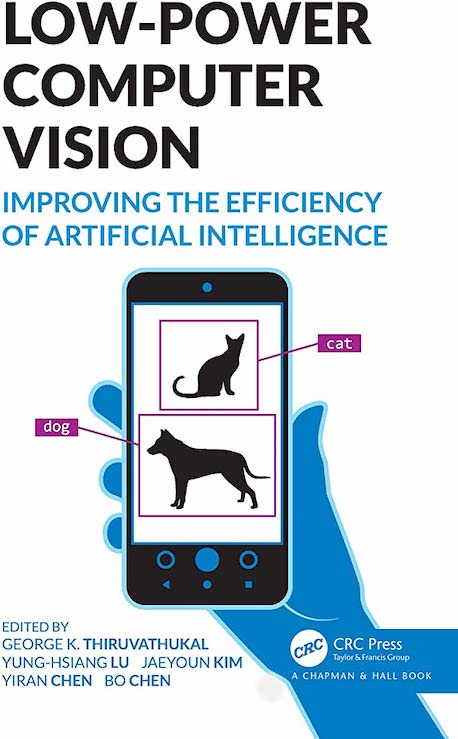

  
<h1 align="center">
  
Low-power computer vision

  
</h1>
  
<b>George K. Thiruvathukal, Yung-Hsiang Lu, Jaeyoun Kim, Yiran Chen, Bo Chen 저</b> 
Chapman and Hall/CRC · 2022년 2월 23일 출시</b> 

## :bulb: 목표

- **Low-Power Computer Vision을 공부한다.**

  > IEEE Low-Power Computer Vision Challenges에서 성과를 얻은 방법들을 공부한다.

 

## :mag: 목차

### Section I Introduction

    History of Low-Power Computer Vision Challenge 

    Survey on Energy-Efficient Deep Neural Networks for Computer Vision 

### Section II Competition Winners

    Hardware design and software practices for efficient neural network inference 

    Progressive Automatic Design of Search Space for One-Shot Neural Architecture Search

    Fast Adjustable Threshold For Uniform Neural Network Quantization

    Power-efficient Neural Network Scheduling on Heterogeneous SoCs

    Efficient Neural Network Architectures

    Design Methodology for Low Power Image Recognition Systems

    Guided Design for Efficient On-device Object Detection Model

### Section III Invited Articles

    Quantizing Neural Networks 

    A practical guide to designing efficient mobile architectures

    A Survey of Quantization Methods for Efficient Neural Network Inference